# List
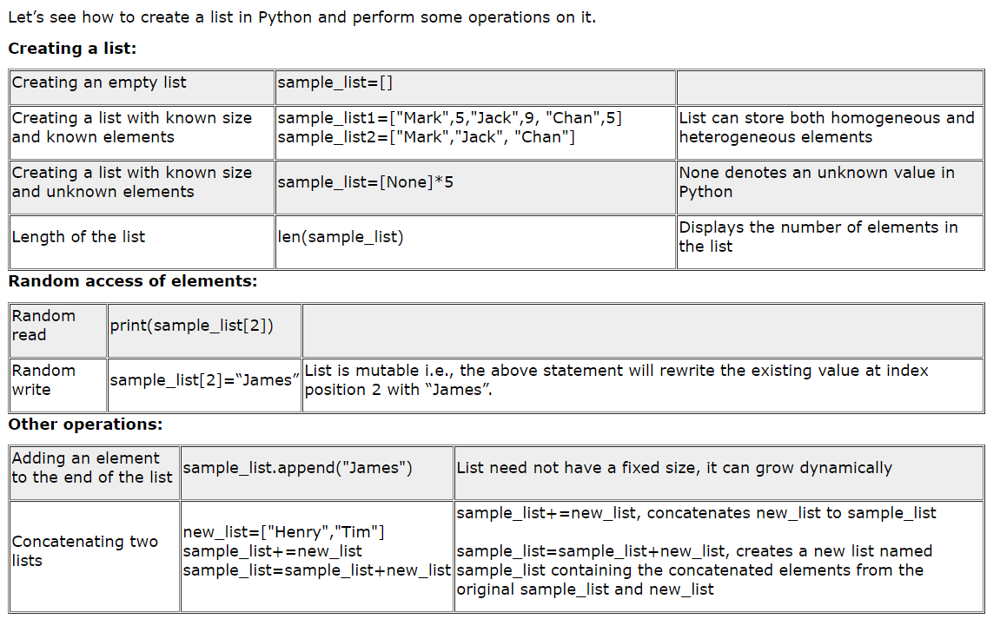
 
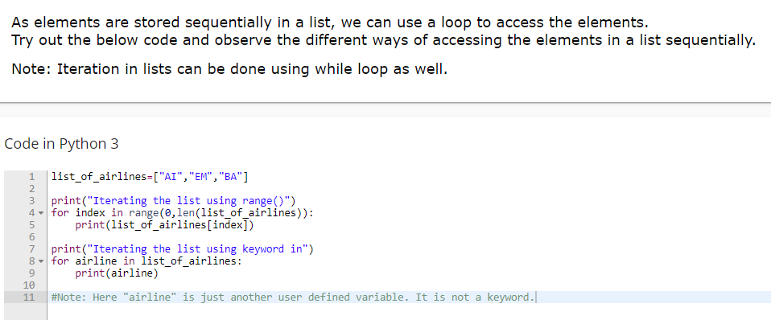
 
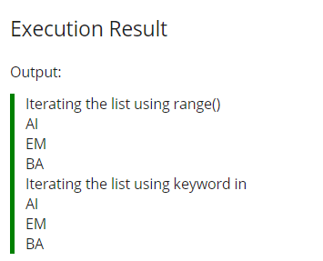
 

## List : Iteration
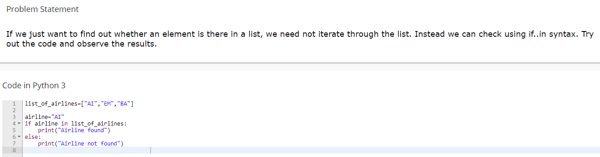
 
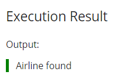
 

## List : Methods
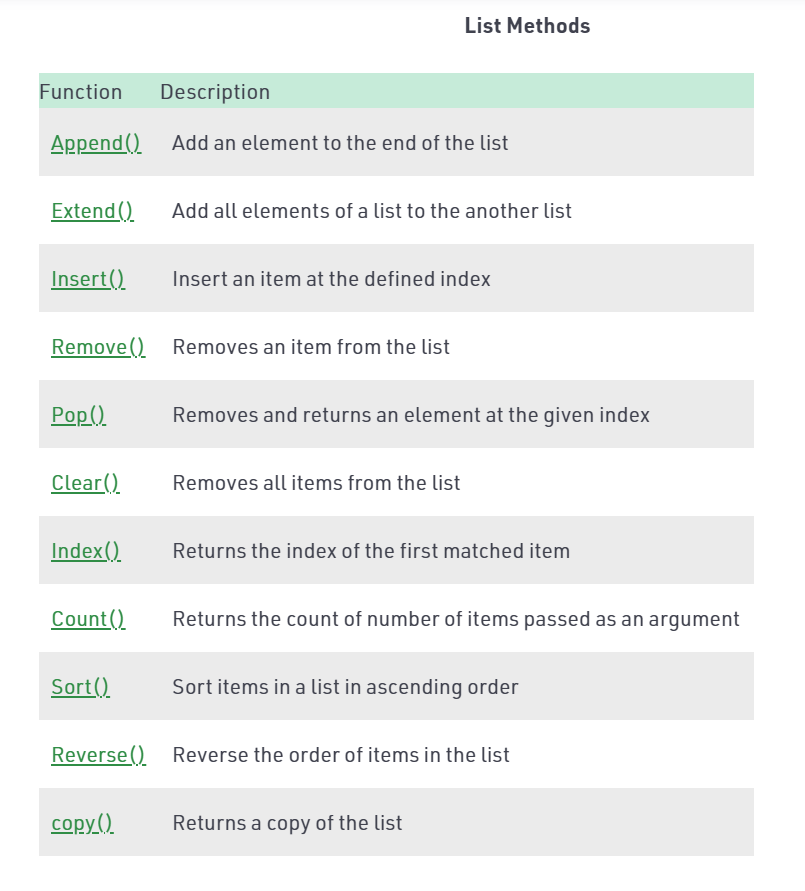
 

## List : Built-in Functions
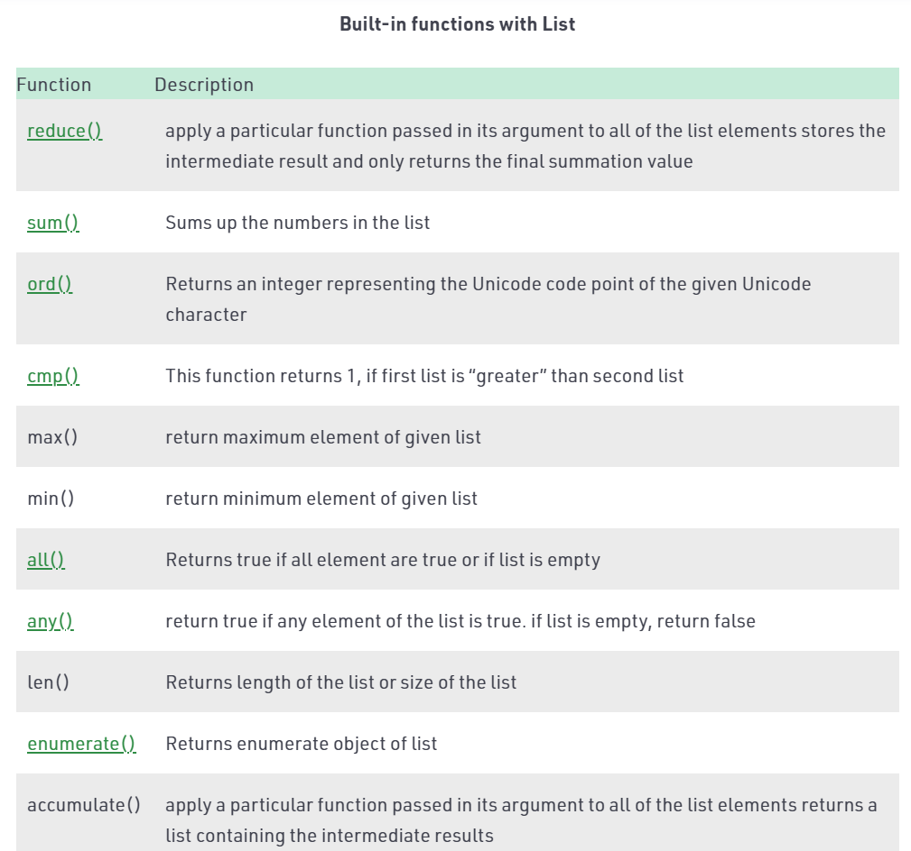
 
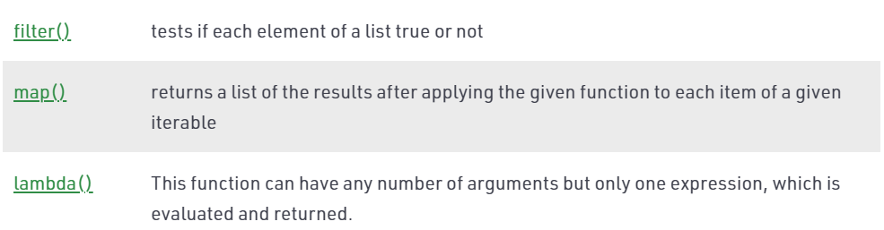
 

## List : Slice
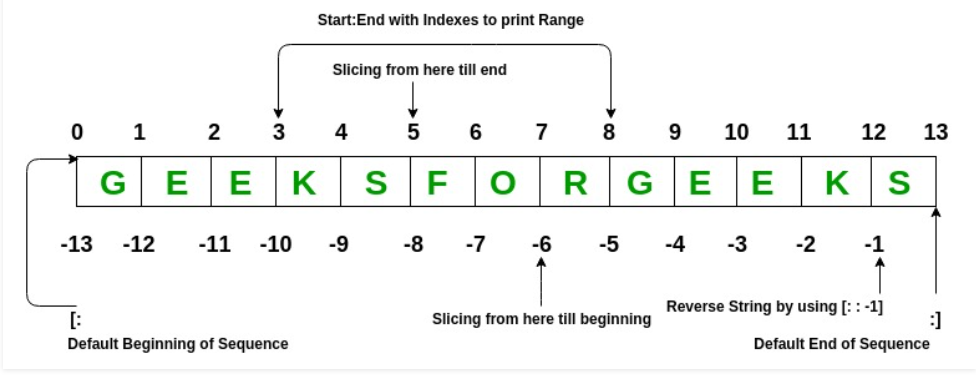
 
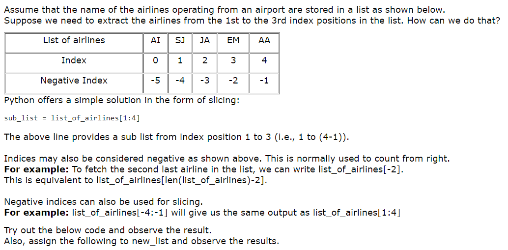
 
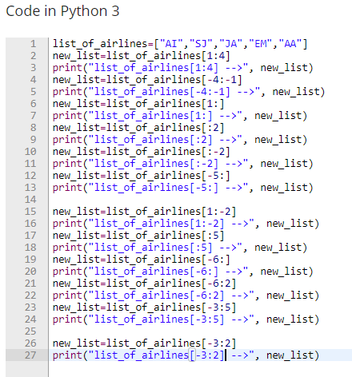
 
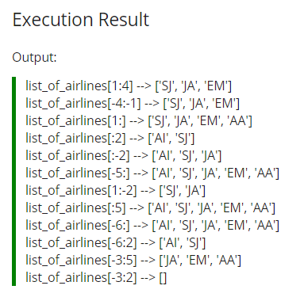
 

## List of Lists
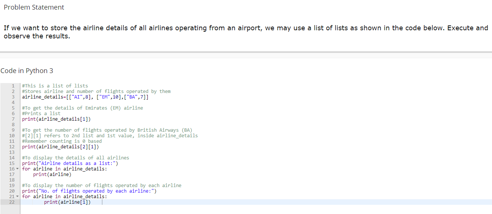
 
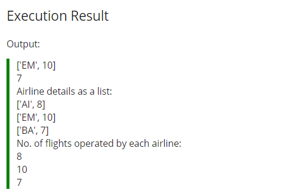
 

## List : Functions
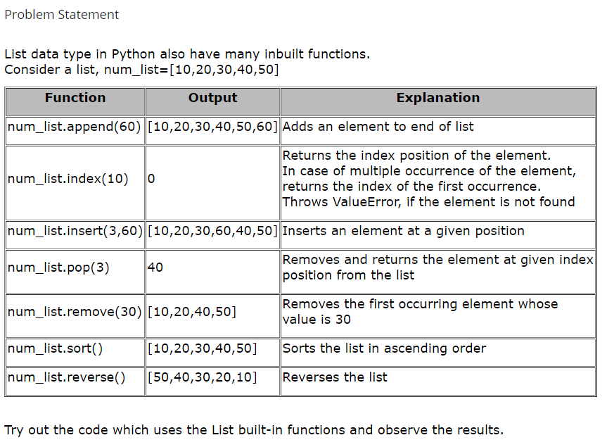
 
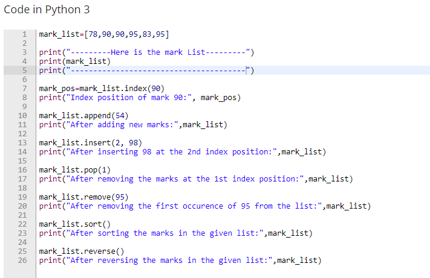
 
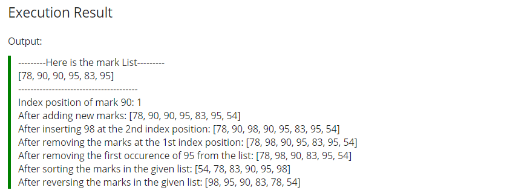
 

## List : QUIZ
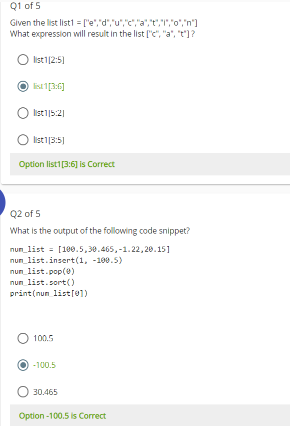
 
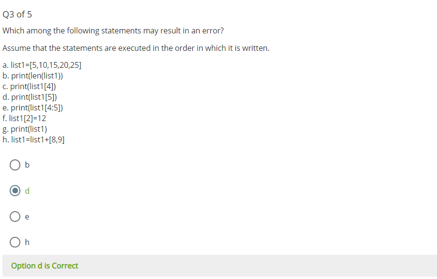
 
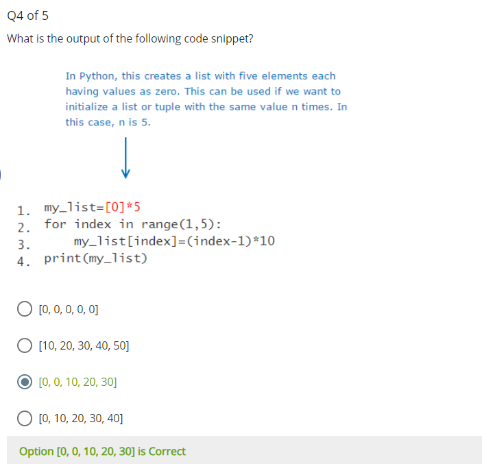
 
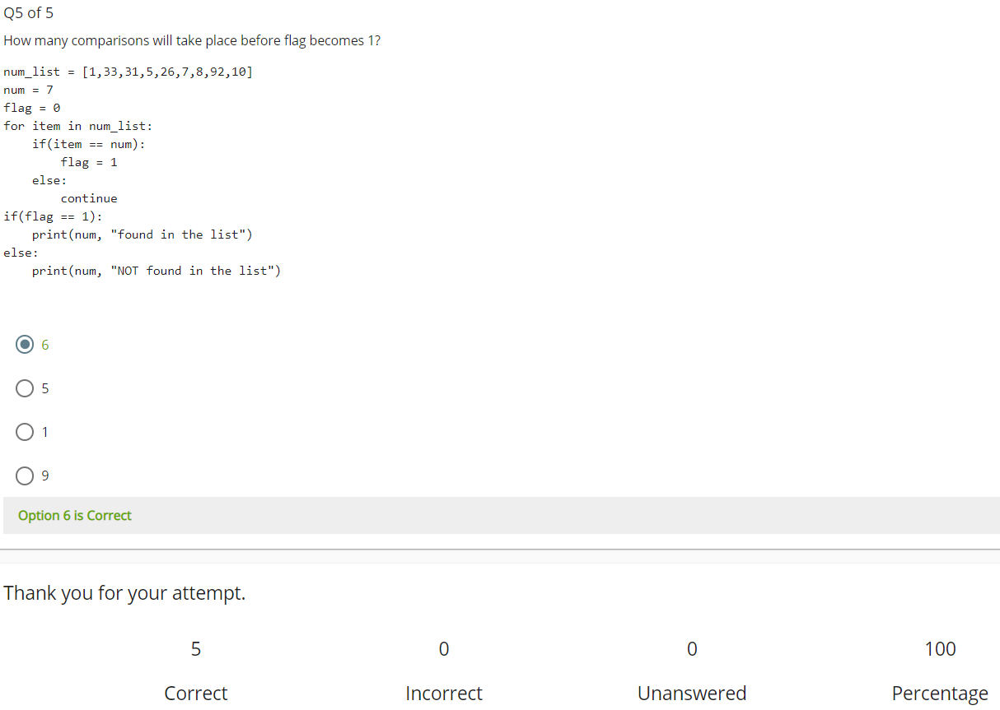
 